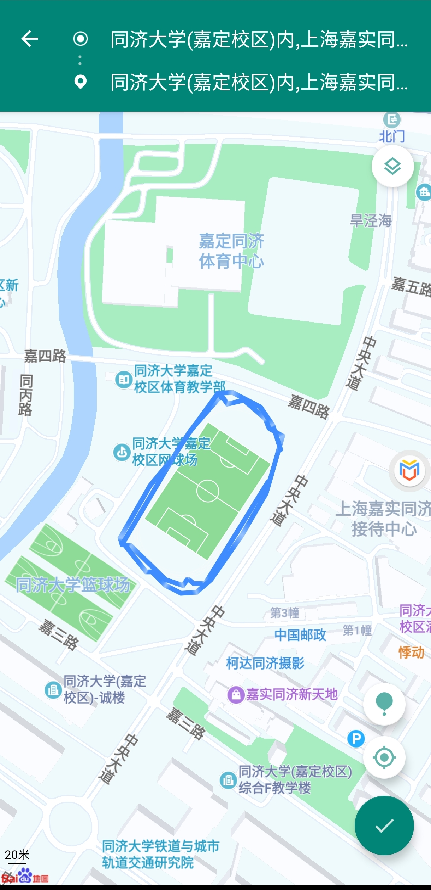
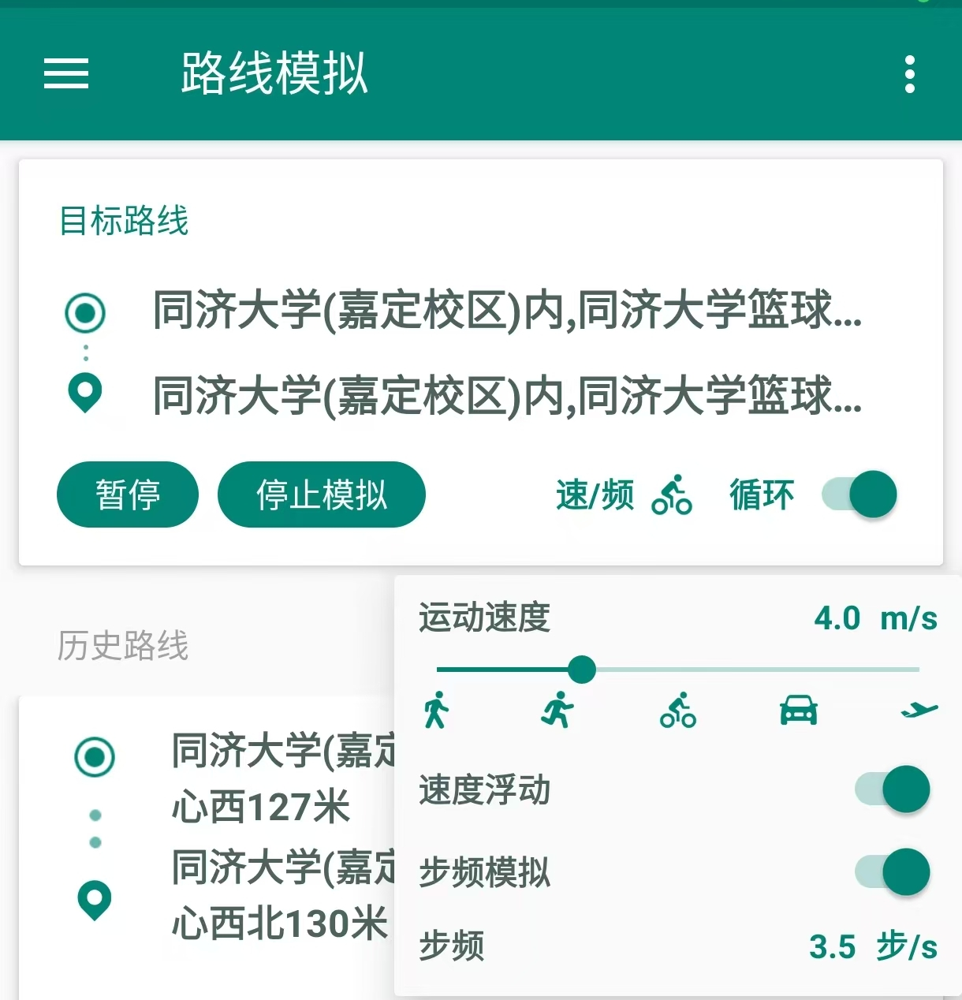
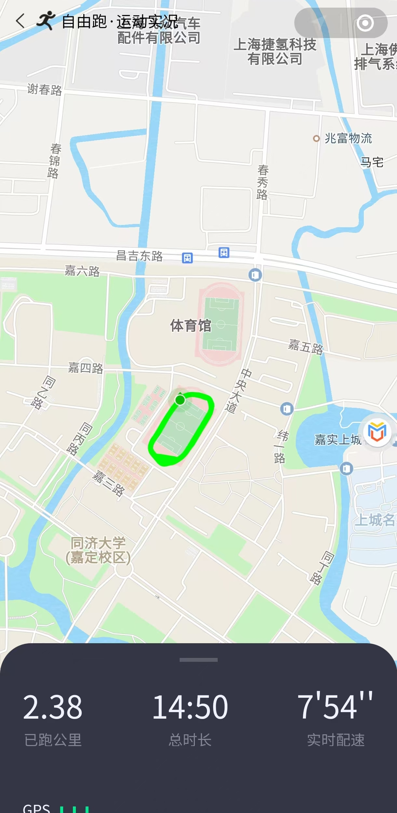

# **Be_A_Lazy_Tongjier**

## 📢 **前情提要**

⚠ **免责声明**：本方法仅供娱乐用途，~~绝不可用于同济体育刷锻小程序！~~

---

## ✨ **原理简介**

本方法基于 **Fake Location** 和 **Virtual Master**，[可在网盘下载](https://pan.baidu.com/s/1JV2xvv1OQSdqOZaai-FXjQ?pwd=4shm)，思路很简单：

1. 在 **拥有 Root 权限** 的虚拟机中安装 **Fake Location**
2. 设置 **虚拟线路** 和 **步频模拟**，伪装真实运动轨迹
3. 运行 **同济体锻**，完成跑步模拟

---

## 🛠 **使用教程**

### **1️⃣ 安装必要软件**

- **Fake Location**（虚拟定位软件，Root 版本）：  
  Root 版本可绕过微信的模拟定位检测，可在 GitHub 仓库 [Fake Location](https://github.com/Lerist/FakeLocation/releases) 下载。

- **Virtual Master**（运行于安卓系统上的虚拟机）：
  - 运行于手机，无需电脑，轻量化，占用空间小，启动速度快
  - 可隔离环境，与现有系统互不干扰
  - 经过测试，**MuMu 等电脑模拟器可能被小程序检测**，导致部分按钮被遮挡
  - **虚拟大师** 更稳定，**解锁会员即自带 Root 权限**，可在本仓库下载

---

### **2️⃣ 配置虚拟机**

1. 安装 **虚拟大师** 并完成初始化设置
2. 下载并导入 **Android 9 ROM** 压缩包（⚠ **比 Android 11 更稳定**），压缩包可到
3. 在虚拟大师中 **开启 Root 权限**，确保 Fake Location 正常运行

## 

### **3️⃣ 配置 Fake Location**

1. 在虚拟机内安装微信、Fake Location 等必要软件
2. 运行 Fake Location，设置 虚拟线路（⚠ 需要会员，可先试用，另一款免费的软件**影梭**貌似也可以，但没有测试过）
3. 在 Fake Location 内手动画出操场轨迹并保存路线
4. 设置模拟参数：
   - 循环次数
   - 移动速度
   - 步频模拟

---

### **4️⃣ 开始打卡！**

1. 在虚拟机内 **安装并登录微信**，确保能正常使用
2. 运行 **Fake Location**，选择保存的路线并开启模拟
3. 启动同济体育，等待一段时间 ⏳
4. 🎉 **恭喜，完成！**

**😆Bye！Enjoy your lazy life! 🏖️**
